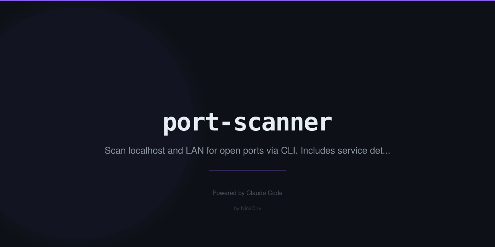

# port-scanner

Fast TCP port scanner with service detection and banner grabbing. **Zero external dependencies** — built entirely on Node.js built-in modules (`net`, `dns`, `os`, `crypto`).

```
  PORT    STATE       SERVICE               BANNER
  ──────────────────────────────────────────────────────────────────────
  22/tcp  open        SSH
  80/tcp  open        HTTP
  443/tcp open        HTTPS
  3000/tcp open       Node.js/Grafana
  ──────────────────────────────────────────────────────────────────────

  4 open  12 filtered  84 closed  — 1.24s
```

## Requirements

- Node.js >= 18
- No `npm install` needed — zero dependencies

## Install

```bash
npm install -g port-scanner
```

Or run directly without installing:

```bash
npx port-scanner <host>
```

Or clone and run:

```bash
git clone https://github.com/NickCirv/port-scanner.git
cd port-scanner
node index.js <host>
```

## Usage

```
port-scanner <host> [options]
pscan <host> [options]         # short alias
```

### Options

| Flag | Description | Default |
|------|-------------|---------|
| `--ports <spec>` | Port range (`1-1024`) or list (`22,80,443`) | top 100 |
| `--top <n>` | Scan top N common ports (built-in list of 1000) | `100` |
| `--timeout <ms>` | Per-port connection timeout in milliseconds | `1000` |
| `--concurrency <n>` | Number of parallel TCP connections | `100` |
| `--host-discovery <cidr>` | TCP ping sweep of a CIDR range | — |
| `--banner` | Grab first 256 bytes of service banner | off |
| `--open` | Show open ports only (hide filtered) | off |
| `--json` | Output results as JSON | off |
| `-h, --help` | Show help | — |
| `-v, --version` | Show version | — |

## Examples

```bash
# Scan top 100 common ports (default)
port-scanner example.com

# Scan a port range
port-scanner 192.168.1.1 --ports 1-1024

# Scan specific ports
port-scanner example.com --ports 22,80,443,3000,8080

# Top 500 ports with 2s timeout
port-scanner 10.0.0.1 --top 500 --timeout 2000

# Banner grabbing
port-scanner example.com --ports 22,80,443 --banner

# Open ports only, JSON output
port-scanner example.com --open --json

# Host discovery — TCP ping sweep of subnet
port-scanner --host-discovery 192.168.1.0/24

# Fast scan with high concurrency
port-scanner example.com --top 1000 --concurrency 200 --timeout 500
```

## Features

- **Top 1000 common ports** built-in — no config needed
- **200+ service mappings** — SSH, HTTP, MySQL, Redis, MongoDB, Kubernetes, Docker, Elasticsearch, and more
- **Concurrency pool** — scan hundreds of ports in parallel with configurable limit
- **Progress bar** — live `X/Total` counter during scan
- **Color output** — green=open, yellow=filtered, grey=closed
- **Banner grabbing** — reads first 256 bytes from open ports
- **Host discovery** — TCP-based ping sweep for CIDR /16 to /30 ranges
- **JSON output** — pipe-friendly structured results
- **Zero dependencies** — ships nothing but `index.js` and `package.json`

## Output

### Default (color table)

```
Scanning example.com (93.184.216.34) — 100 ports

  PORT      STATE       SERVICE               BANNER
  ──────────────────────────────────────────────────────────────────────
  80/tcp    open        HTTP
  443/tcp   open        HTTPS
  ──────────────────────────────────────────────────────────────────────

  2 open  3 filtered  95 closed  — 2.11s
```

### JSON (`--json`)

```json
{
  "host": "example.com",
  "ip": "93.184.216.34",
  "scannedAt": "2026-03-03T09:00:00.000Z",
  "scanTime": 2110,
  "summary": { "open": 2, "filtered": 3, "closed": 95 },
  "ports": [
    { "port": 80, "status": "open", "banner": null, "service": "HTTP" },
    { "port": 443, "status": "open", "banner": null, "service": "HTTPS" }
  ]
}
```

## Security

- Zero external dependencies — no supply chain risk
- Uses `net.createConnection()` — no raw sockets, no root required
- No shell exec — all operations via Node.js APIs
- Sensitive values via `process.env` only

## Ethical Use Disclaimer

**Only scan hosts and networks you own or have explicit written permission to scan.**

Unauthorized port scanning may:
- Violate computer fraud and abuse laws in your jurisdiction
- Breach terms of service of networks and hosting providers
- Constitute illegal access to computer systems

The author assumes no liability for misuse of this tool.

## License

MIT
